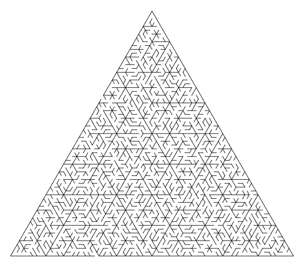

# recursive mazes in logo

Generating mazes by a recursive algorithm is fairly simple: subdivide a shape
into self-similar subshapes that you will recursively maze later; create divisions
between them with enough holes to create a 'tree' (in the graph sense) between
the subshapes; then recursively generate mazes in the subshapes. This algorithm seems
like the best choice for a twigs-and-mud environment, like the Logo language, which can
easily handle the rendering. The code in this repo can generate rectangular mazes,
a basic trapezoidal maze, which can then be used to generate hexagonal or triangular
mazes, and the Koch snowflake maze, which is not well suited to this method because
of the mixing of powers of two and powers of three.

-- Steven E. Pav, shabbychef@gmail.com

# mazes

Some screenshots here, all generated from the [calormen online logo interpreter](http://www.calormen.com/jslogo/#):

